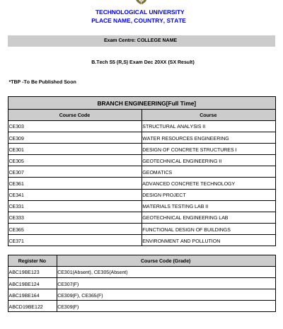

# Result (KTU) PDF to XLSX 
### A script to convert Tabular PDF to XLSX

This script is used to convert our University's Results (provided in Tabular PDF) to an XLSX Format, removing unwanted data.

Features:
* Uses Pure python3 Code
* Command Line Interface
* Simple Functionality
* Now Includes support for 2 Conversion Engines
* Modular Code based on Multiple Functions
* Clean-up Function to remove Intermediate Data files
* Also attempts to install missing packages `pip3`

Instructions:

* Clone this Repository to a folder
* This Module requires additional modules
  * Pandas 
    * `pip3 install pandas`
  * Pdf2Py
    * `pip3 install pdfminer`
  * OpenPyXl
    * `pip3 install openpyxl`
  * XLSXWriter
    * `pip3 install xlsxwriter`
* Execute the Script using *Python 3* or above

##### Sample Input

##### Sample Output

* Enter the file Name of the Source File (PDF)
  * The Script will detect the Branches Automatically
  * And remove the Trailing Signature and Date to prevent Complication
* Enter Destination File (XLSX)
* Done, you will find your file in the working directory

#### Syntax to Use

        $ python3 main.py

follow the Support Wizard and you're done!

#### Sample Execution

        $ python3 main.py 
                        (PYTHON 3) PDF TO XLSX CONVERTER

        Source File Name[PDF]: sample.pdf

        CREATING WORKSPACE

        Workspace : Created
                        PDF TO TEXT - 2 Engines Available
        1.PDFMiner(Python Based)
        2.PDFtoText(Linux Based)
        Specify option number:1
        Using Text Engine 1(Default)
        Conversion : Success

        CREATING WORKSPACE

        University:                  TECHNOLOGICAL UNIVERSITY

        COLLEGE NAME
        Detected:BRANCH ENGINEERING[Full Time]
        Data Preprocess : Caught Trailing Signature
        Data Preprocess : Success

        FINISHING UP

        Destination File Name[XLSX]: sample_output 
        Processing . . .BRANCH ENGINEERING[Full Time]

                        OPTIONAL
        CleanUp : Clear Cached Files? y/n : y
        CleanUp :  Success
                        COMPLETE

#### Future Updates

* Support for complete CLI support `-c -s` arguments
* More robust code that supports other PDFs as well
